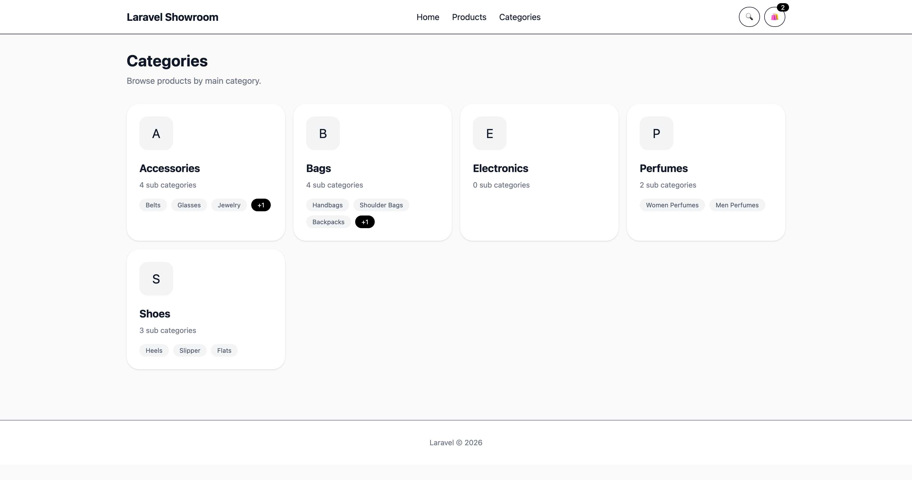
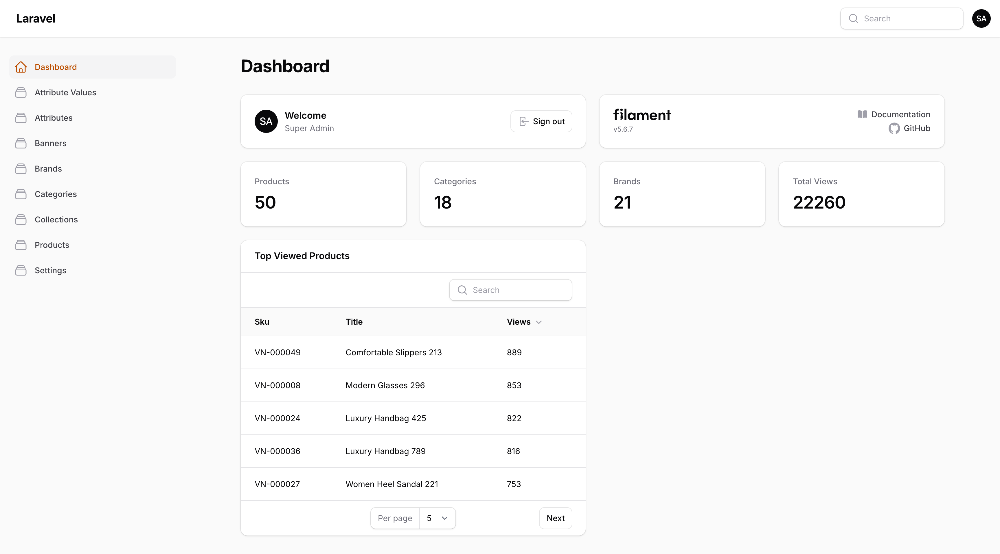
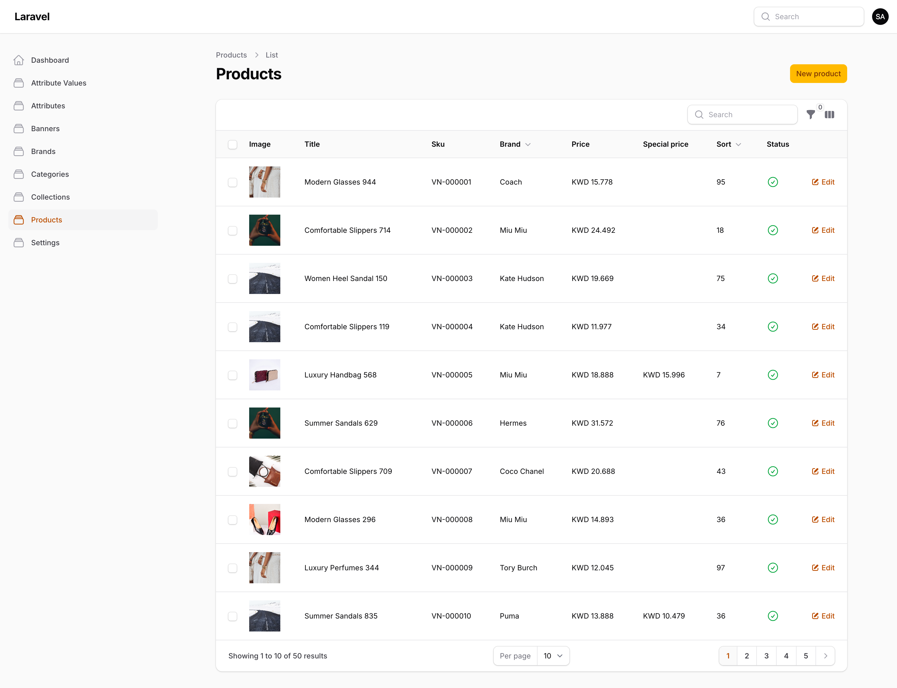

# Laravel Product Catalog

Modern product catalog and showroom built with Laravel 13, Filament, Vue 3, Tailwind CSS, Vite, Spatie Media Library, and Docker/Laravel Sail.


## Overview

Laravel Product Catalog is a responsive product showcase platform for businesses that want to display products professionally without implementing checkout.

It is useful for fashion stores, shoes and bags, cosmetics, furniture, electronics, product showrooms, WhatsApp selling, and Instagram businesses.

## Screenshots

### Home page


### Products page


### Categories page



### Product details page


### Admin dashboard



### Admin products



## Features

### Customer website

- Responsive Vue frontend
- Homepage banners
- Product categories and subcategories
- Product listing and product details pages
- Image gallery, GIF support, and video support
- Product search
- Brand filtering
- Related products
- Breadcrumb navigation
- Favorites / “My Selection”
- WhatsApp product inquiry
- Mobile navigation
- SEO-friendly URLs

### Admin panel

Built with Filament.

- Dashboard
- Products
- Categories
- Brands
- Collections
- Banners
- Product attributes
- Product media
- Global settings
- Drag-and-drop image uploads
- Product sorting
- Featured products
- Product visibility
- Media management

### API

REST API built for the Vue frontend.

```txt
GET /api/v1/home
GET /api/v1/products
GET /api/v1/products/{slug}
GET /api/v1/categories
GET /api/v1/categories/{slug}
GET /api/v1/collections/{slug}
GET /api/v1/products/search
GET /api/v1/products/filters
```

## Tech stack

- Laravel 13
- PHP 8.4+
- MySQL 8.4
- Filament
- Spatie Media Library
- Vue 3
- Vue Router
- Pinia
- Tailwind CSS
- Vite
- Docker
- Laravel Sail

## Requirements

You only need these installed on your machine:

- Docker Desktop, or Docker Engine with Docker Compose
- Git

You do not need to install PHP, Composer, Node, or MySQL on your host machine. The commands below run them inside Docker.

## Installation with Docker

Clone the repository:

```bash
git clone https://github.com/HossamAlex/laravel-product-catalog.git
cd laravel-product-catalog
```

Run the installer:

```bash
chmod +x install.sh
./install.sh
```

That command installs Composer dependencies, creates `.env`, starts Sail, installs frontend dependencies, migrates/seeds the database, creates the storage link, clears caches, and builds frontend assets.

If you prefer to run the steps manually, follow the order below.

### Manual installation

First install Composer dependencies using a temporary Docker container. This creates the `vendor` directory and makes `./vendor/bin/sail` available. Do this before running any `./vendor/bin/sail ...` command:

```bash
docker run --rm \
  -u "$(id -u):$(id -g)" \
  -v "$(pwd):/var/www/html" \
  -w /var/www/html \
  laravelsail/php84-composer:latest \
  composer install --ignore-platform-req=ext-intl --ignore-platform-req=ext-exif
```

The temporary Composer image may not include the `intl` and `exif` PHP extensions. That is okay for this bootstrap step; the Sail application container includes the extensions needed by Filament and Spatie Media Library.

On Windows, use WSL2 and run the same commands from the Linux terminal. That keeps file permissions and Sail scripts consistent.

Create the environment file:

```bash
cp .env.example .env
```

Start the Docker containers:

```bash
./vendor/bin/sail up -d
```

Confirm the app and database containers are running:

```bash
./vendor/bin/sail ps
```

You should see both `laravel.test` and `mysql` running before executing Artisan commands.

Install frontend dependencies inside Docker:

```bash
./vendor/bin/sail npm install
```

Prepare Laravel:

```bash
./vendor/bin/sail artisan key:generate
./vendor/bin/sail artisan storage:link
./vendor/bin/sail artisan migrate:fresh --seed
./vendor/bin/sail artisan optimize:clear
```

Do not open the website before `migrate:fresh --seed` completes. The app uses database sessions, so opening the site too early can show a `sessions` table or MySQL connection error.

Build frontend assets:

```bash
./vendor/bin/sail npm run build
```

Open the app:

```txt
Website:     http://localhost:8081
Admin panel: http://localhost:8081/admin
API:         http://localhost:8081/api/v1
Mailpit:     http://localhost:8025
```

Default admin login:

```txt
Email:    admin@gmail.com
Password: 123
```

## Development

Start the containers:

```bash
./vendor/bin/sail up -d
```

Run the Vite dev server:

```bash
./vendor/bin/sail npm run dev
```

Then open:

```txt
http://localhost:8081
```

Stop the containers:

```bash
./vendor/bin/sail down
```

## Testing

Run backend tests inside Docker:

```bash
./vendor/bin/sail test
```

Run the frontend production build check inside Docker:

```bash
./vendor/bin/sail npm run build
```

## Reset demo data

If you want a clean database with demo products, categories, banners, brands, and settings:

```bash
./vendor/bin/sail artisan migrate:fresh --seed
```

Demo product and banner seed images live in `storage/app/demo`. Keep that folder committed; the generated Spatie Media Library files in `storage/app/public` should stay ignored because they are recreated by the seeders.

## Troubleshooting

### `./vendor/bin/sail: No such file or directory`

This means `vendor/` does not exist yet. On a fresh clone, run the installer:

```bash
chmod +x install.sh
./install.sh
```

Or run the Docker Composer bootstrap command manually:

```bash
docker run --rm \
  -u "$(id -u):$(id -g)" \
  -v "$(pwd):/var/www/html" \
  -w /var/www/html \
  laravelsail/php84-composer:latest \
  composer install --ignore-platform-req=ext-intl --ignore-platform-req=ext-exif
```

### `getaddrinfo for mysql failed` or `Host: mysql`

This means Laravel cannot reach the Docker MySQL service yet. Make sure Sail is running and MySQL is listed:

```bash
./vendor/bin/sail up -d
./vendor/bin/sail ps
```

If `laravel.test` or `mysql` is missing, rebuild/start the containers:

```bash
./vendor/bin/sail up -d --build
```

Then run the Laravel setup commands again:

```bash
./vendor/bin/sail artisan key:generate
./vendor/bin/sail artisan storage:link
./vendor/bin/sail artisan migrate:fresh --seed
./vendor/bin/sail artisan optimize:clear
```

Also make sure you are using `./vendor/bin/sail artisan ...`, not `php artisan ...`, because `DB_HOST=mysql` only works inside Docker.

### `ext-intl` or `ext-exif` is missing during Composer install

Use the bootstrap Composer command from this README exactly. It ignores only those two extension checks while creating `vendor`:

```bash
docker run --rm \
  -u "$(id -u):$(id -g)" \
  -v "$(pwd):/var/www/html" \
  -w /var/www/html \
  laravelsail/php84-composer:latest \
  composer install --ignore-platform-req=ext-intl --ignore-platform-req=ext-exif
```

After Sail is installed, use Sail for Composer commands:

```bash
./vendor/bin/sail composer install
```

### PHP version errors on your computer

Do not run `php artisan ...` or `composer install` directly on your host machine unless your local PHP matches the project. Use Sail commands instead:

```bash
./vendor/bin/sail artisan test
./vendor/bin/sail composer install
```

### Node or Vite version errors on your computer

Do not run `npm run build` directly on your host machine if your Node version is old. Use Sail:

```bash
./vendor/bin/sail npm install
./vendor/bin/sail npm run build
```

### Port already in use

The app uses port `8081` by default. To change it, edit `APP_PORT` in `.env`, then restart Sail:

```bash
./vendor/bin/sail down
./vendor/bin/sail up -d
```

### Images are not showing

Make sure the storage link exists and demo data was seeded:

```bash
./vendor/bin/sail artisan storage:link
./vendor/bin/sail artisan migrate:fresh --seed
```

## Project structure

```txt
app
 ├── Http
 ├── Models
 ├── Services
 ├── Traits
 └── Policies

resources
 ├── js
 │    ├── api
 │    ├── components
 │    ├── pages
 │    ├── router
 │    ├── services
 │    ├── stores
 │    └── utils
 └── views

database
 ├── migrations
 ├── seeders
 └── factories

routes
```

## License

This project is licensed under the MIT License.

## Author

Developed by **Hossam Elgendy**.

- GitHub: https://github.com/HossamAlex
- LinkedIn: https://www.linkedin.com/in/hossam-elgendy-dev
